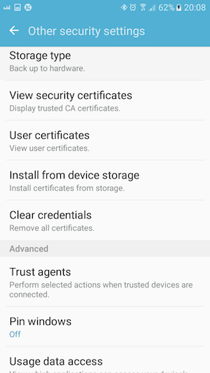

# Xamarin Mutual Authentication sample
## Project content
- **Client** Console application 
- **Server** Console application
- **Xamarin.Android** that acts as Client, two modes for TLS Mutual Authentication connection establishing: Java way (that currently works perfectly) and the .Net way (same code as **Client**) that's not working for the moment.
## Certificates Generation using OpenSSL
In order to be able to install the certificate in Android as Trusted CA, we need to create a file "android_options.txt" that contains the line below:
```
basicConstraints=CA:true'
```
Create self signed certificates using the commands below:
```
openssl genrsa -out priv_and_pub.key 2048
openssl req -new -days 3650 -key priv_and_pub.key -out CA.pem
openssl x509 -req -days 3650 -in CA.pem -signkey priv_and_pub.key -extfile ./android_options.txt -out CA.crt
```
Optionally, the certificate can be converted to DER format:
```
openssl x509 -inform PEM -outform DER -in CA.crt -out CA.der.crt
```
To create a pkcs12 keystore:
```
openssl pkcs12 -export -inkey priv_and_pub.key  -in CA.crt -name Server -out Server.pfx
```
## Trust the certificate in Android
1. Go to Settings then 'Lock screen and security'

2. Choose 'Other security settings'

3. Choose 'Install from device storage' then select the Certificate (or keystore) in the device storage

4. Choose a name, select 'VPN and apps' then validate, the certifcate can be found in 'Security certificates' as trusted CA


## References
1. https://aboutssl.org/how-to-create-and-import-self-signed-certificate-to-android-device/
2. https://www.codeproject.com/Articles/326574/An-Introduction-to-Mutual-SSL-Authentication
